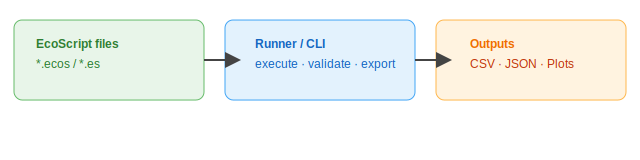

# EcoScript

  


About
EcoScript is a lightweight domain-specific language (DSL) and runtime for building, running, and sharing small ecological and environmental models, reproducible simulation workflows, and data-processing pipelines. It focuses on human-readable scripts, sensible defaults for common ecological tasks, and simple export and visualization helpers for rapid prototyping and teaching.

Repository short description (for GitHub About / tagline)
Lightweight DSL + runner for ecological models, simulations, and exportable results

Why EcoScript
EcoScript is designed for anyone who wants to express environmental models or small simulations in a compact, readable format without the overhead of a heavyweight framework. Typical uses:
- Quick prototyping of population, growth, and resource-consumption models
- Teaching simulation concepts with simple, reproducible scripts
- Small analysis pipelines that export CSV/JSON and quick plots for exploration

Key goals:
- Make it quick to write small ecosystem / environment scripts
- Provide sensible defaults and helpful diagnostics for new users
- Enable exporting results, plots, and simple visualizations
- Keep the runtime lightweight and easy to embed in other tools

Features
- Compact, readable script syntax for describing ecological models, workflows, and data transforms
- CLI runner to validate and execute scripts
- Exportable results in CSV/JSON and quick plotting helpers
- Extensible plugin points for custom steps, visualization, and I/O

Architecture


Getting started

1. Install (example; replace with real install steps when available)
```bash
# install from source (example)
git clone https://github.com/drfletcher21/ecoscript.git
cd ecoscript
# follow project-specific install steps (e.g. pip install -e . or npm install)
```

2. Example script (save as example.ecos)
```text
# example.ecos
model "simple-plant" {
  param growth_rate = 0.1
  param mortality = 0.01

  step simulate for 100 days {
    # simulate growth & mortality
  }
}
```

3. Run
```bash
ecoscript run example.ecos --output results.csv
```

Images and assets
- This repository will include `assets/logo.svg` and `assets/architecture.svg` referenced above.
- If you prefer embedded data URIs instead of separate files I can switch to that.

Contributing
- Open issues for bugs and feature requests
- Fork, create a branch, add tests/examples, then open a pull request
- Follow the code style and include a short description in PRs

License
- This repository is licensed under the MIT License. See the LICENSE file for details.
